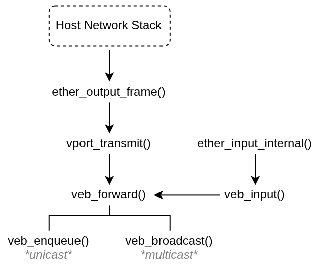

# if_veb architecture
`if_veb` is derived from `if_bridge(4)` and keeps some of its structure. Rationale for the divergences is in `design.md` and what is missing is in `roadmap.md`.

## 1. Overview
Two cloners. `veb` is the bridge: member list, forwarding table, aging callout. `vport` is the host's port on a veb, and is the only way the host gets an L2 presence. The veb ifnet itself is not a data-plane endpoint.

Every frame entering the bridge, either from a member's `if_bridge_input` hook or from a vport's `if_transmit`, lands in `veb_forward()`. From there: learn the source, look up the destination in the (MAC, VLAN) table, enqueue to one port or flood.

## 2. Inherited unchanged
Renamed but structurally identical to `if_bridge`, including the constants:

| Area              | Notes                                                                                                                                                                                  |
| ----------------- | -------------------------------------------------------------------------------------------------------------------------------------------------------------------------------------- |
| Forwarding table  | 1024 buckets, Jenkins mix, sorted buckets, `sc_rtlist` for walks, 2000 entries, 20-minute timeout, 5-minute prune, per-vnet UMA zone, lock-free lookup with recheck under the rt mutex |
| Aging and flush   | `veb_timer()` / `veb_rtage()` / `veb_rtdelete()` / `veb_rtflush()`, `callout_init_mtx()` against the rt mutex, `CURVNET_SET()` in the callout and the free callback                    |
| Locking shape     | sx for configuration, mtx for the rtable, `NET_EPOCH` for readers                                                                                                                      |
| Control dispatch  | `SIOCGDRVSPEC`/`SIOCSDRVSPEC` through a table with copyin/copyout/suser flags, argsize and direction validation, `PRIV_NET_BRIDGE`                                                     |
| Capabilities      | `veb_mutecaps()` intersecting the mask across members' saved caps, LRO stripped                                                                                                        |
| MTU               | first member defines it, `SIOCSIFMTU` pushes to all members with rollback                                                                                                              |
| Link state        | up if any member is up (besides vport), default-up when no member reports link state                                                                                                   |
| Port flags        | `IFVP_LEARNING`, `IFVP_DISCOVER`, `IFVP_STICKY`, `IFVP_PRIVATE` behave as their `IFBIF_` counterparts                                                                                  |
| MAC inheritance   | `inherit_mac` sysctl, re-inheritance on member removal                                                                                                                                 |
| Member add checks | SVI rejection, duplicate, already-bridged, MTU negotiation                                                                                                                             |
| Sysctls           | `inherit_mac`, `log_mac_flap`, prune period — the last is per-vnet here, a plain global in `if_bridge`                                                                                 |

Absent entirely: STP, pfil, span ports, netmap injection (`M_BRIDGE_INJECT`), `IFT_GIF` members, the global instance list, and `member_ifaddrs`.

## 3. vport
The wheel that wasn't reinvented. `if_bridge` gives the host L2 presence by making the bridge ifnet itself an endpoint: `bridge_input()` claims frames addressed to a member's MAC (`GRAB_OUR_PACKETS`) and reinjects broadcasts up the stack. `veb` does neither. `veb_transmit()` frees the mbuf and returns `ENETDOWN`, and nothing is ever reinjected. The host attaches a `vport` instead.

### 3.1 Not an ordinary member
`if_bridge` is never set on a vport. `ether_output()` and `ether_input_internal()` both branch on it before reaching `if_transmit`, so setting it would divert the vport's own transmits into the forwarding path and loop its receives back in. Association lives in `vport_softc.sc_vp` instead, which is why `veb_port_of()` exists (section 4).

A vport is otherwise an ordinary `IFT_ETHER` interface with a generated MAC: the host addresses it, sets flags on it, and joins multicast groups on it.

### 3.2 Direction split
For a member, both directions are `if_transmit`-shaped. For a vport they are opposite:

| Direction     | Path                                                          |
| ------------- | ------------------------------------------------------------- |
| host → bridge | `ether_output_frame()` → `vport_transmit()` → `veb_forward()` |
| bridge → host | `veb_enqueue()` → `dst_ifp->if_input()`                       |

Using `if_transmit()` for delivery would send the frame straight back into the bridge. The delivery branch in `veb_enqueue()` therefore has to do by hand what a driver's receive path normally does:

- Release any `snd_tag` and clear `CSUM_SND_TAG` *before* writing `rcvif`. They share a union in `struct pkthdr` and the flag says which is live; writing `rcvif` first leaks the driver's reference.
- `m_tag_delete_nonpersistent()`, set `rcvif`, `M_SETFIB()` from the destination.
- Charge counters before `if_input()`, since the mbuf belongs to the stack afterwards. `IPACKETS` is charged explicitly: `ether_input()` charges `IMCASTS` and `IBYTES` (the latter only without `IFCAP_HWSTATS`) but never `IPACKETS`.

`vport_transmit()` taps BPF itself, because `ether_output()` does not tap on this path and `veb_forward()` taps the veb rather than the vport. It drops with `ENETDOWN` when `sc_vp` is NULL; no veb, no carrier.

One consequence for the veb's own counters: `IPACKETS`/`IBYTES` are charged at `veb_forward()` entry, which host traffic also reaches, so a veb's input counters mean "frames forwarded", not "frames received from the wire".

### 3.3 vport_ioctl
Members lose their ioctl to `veb_p_ioctl()` (section 5). A vport keeps `vport_ioctl()` permanently; membership never interposes. Only two gates:

- `SIOCSIFMTU` is refused with `EBUSY` while a member, because the veb owns member MTU. This has to be enforced here: `ifhwioctl()`'s "no MTU changes on bridge members" guard keys off `if_bridge`, which is deliberately NULL on a vport. `SIOCSIFMTU` from the veb's own push path writes `if_mtu` directly (`IS_VPORT()` short-circuits the ioctl call) — there is no driver underneath to negotiate with.
- Everything not handled locally is refused with `EINVAL` while *not* a member, and passed to `ether_ioctl()` while a member. Pre-veb-attach vport configuration is not allowed, as a vport is useless without a veb.

`VPORT_LOCK` is dropped around `ether_ioctl()` because the `SIOCSIFADDR` path re-enters `vport_init()`. Every case sets `error` and breaks; the unlock at the bottom is the only release.

### 3.4 Other vport asymmetries
- A veb accepts at most one vport (`IFVEB_HASVPORT`).
- Vports do not contribute to link state as there is no physical link to report. A vport-only veb therefore reports down.
- `vport_clone_destroy()` asserts `sc_vp == NULL`. `veb_ifdetach()` on `ifnet_departure_event` is what makes that hold.
- `vnet_veb_uninit()` detaches the veb cloner before the vport cloner: detaching a cloner destroys its instances, and `veb_delete_member()` must run while the vport ifnets and softcs are still alive.

## 4. Resolving ifnet to port
`if_bridge` dereferences `ifp->if_bridge` and is done. Two things break that here: a vport has no `ifp->if_bridge`, and `ifp->if_bridge` alone does not prove *this* driver installed it.

`veb_port_of()` is the single resolver. If `if_ioctl == vport_ioctl`, read `vport_softc.sc_vp`. Otherwise require `ifp->if_bridge_input == veb_input` before trusting `ifp->if_bridge`. Callers must hold `VEB_LOCK` or be in `NET_EPOCH`; `veb_lookup_member_if()` is the assert-carrying wrapper.

`sc_vp` is read under three regimes: written under `VEB_LOCK`, read under `NET_EPOCH` by `vport_transmit()` and `veb_port_of()` (which is what keeps the resolved port alive across the read), and read under `VPORT_LOCK` alone by `vport_ioctl()`. The last is unsynchronised against the writer. It is acceptable because it answers policy questions only, never dereferences, and losing the race returns the answer from a moment earlier.

Lock order is `VEB_LOCK -> VPORT_LOCK` and `VEB_LOCK -> VEB_RT_LOCK`; neither reverse is taken. `vport_ioctl()` must therefore never acquire `VEB_LOCK`.

## 5. Member isolation
`if_bridge` leaves a member's `if_ioctl` alone and gates member configuration case by case, with `net.link.bridge.member_ifaddrs` as an opt-out. `veb` follows OpenBSD instead: `veb_ioctl_add()` saves `if_ioctl` in `vp_ioctl` and installs `veb_p_ioctl()`, which passes `SIOCSIFFLAGS` (used by `ifpromisc()`), `SIOCSIFMTU`, `SIOCADDMULTI` and `SIOCDELMULTI` through, refuses `SIOCSIFADDR`/`SIOCAIFADDR`/`SIOCSIFCAP` with `EBUSY`, and refuses any other `IOC_IN` command by default. So, a write-side ioctl added to the tree later is denied rather than silently allowed. Read-only commands fall through. A port already cleared by a concurrent delete returns `EOPNOTSUPP`.

Members may never hold an IP address: there is no `member_ifaddrs` equivalent, and the check at add time is unconditional. `veb_set_ifcap()` calls `vp_ioctl` directly, since `veb_p_ioctl()` would deny its own `SIOCSIFCAP`.

## 6. Data path deltas
Everything in `veb_forward()`, `veb_broadcast()` and the learning path matches `bridge_forward()` and friends, minus STP state checks, pfil hooks and span delivery. Three differences worth naming:

- The BPF tap on the veb is unconditional and happens in `veb_forward()` before dispatch. Since frames are never reinjected into `ether_input()`, this is the veb's only tap point, so it cannot be conditional on the forwarding outcome.
- `veb_input()` returns the mbuf unconsumed when: the member has a `vlan(4)` trunk and the frame is tagged, `ifp->if_bridge` raced to NULL, or when the veb is not running. Everything else is consumed. `IFF_MONITOR` frames are tapped, counted against the veb, and freed.
- Delivery to a vport takes the `if_input()` branch described in section 3.2.

## 7. Control ABI
A private surface rather than a rename of `BRDG*`: `VEBADD`, `VEBDEL`, `VEBGIFS`, `VEBGRTS`, `VEBGIFFLGS`, `VEBSIFFLGS`, `VEBGTO`, `VEBSTO`, over `ifvreq` / `ifvpconf` / `ifvaconf` / `ifvrparam`. Dispatch, validation and the two-call size convention are `if_bridge`'s. Errors carry `EXTERROR` messages throughout.

Not carried over from `if_bridge`: flush, static addresses, address limits, priority/STP parameters, span ports, VLAN set commands.

## 8. Invariants worth knowing

| Invariant                                                     | Enforced by                                                                       |
| ------------------------------------------------------------- | --------------------------------------------------------------------------------- |
| `if_bridge` is never set on a vport                           | `IS_VPORT()` guard in `veb_ioctl_add()`                                           |
| at most one vport per veb                                     | `IFVEB_HASVPORT` check in `veb_ioctl_add()`                                       |
| a vport is never destroyed while a member                     | `KASSERT` in `vport_clone_destroy()`, held by `veb_ifdetach()`                    |
| an ifnet resolves to a veb port only if this driver hooked it | `if_bridge_input == veb_input` check in `veb_port_of()`                           |
| members hold no IP addresses                                  | scan in `veb_ioctl_add()`, `SIOCSIFADDR`/`SIOCAIFADDR` refused in `veb_p_ioctl()` |
| members never reach `ether_output()`                          | the row above, see section 5                                                      |
| `vp_addrcnt == 0` at member removal                           | `KASSERT` in `veb_delete_member()`, held by the preceding `veb_rtdelete()`        |

