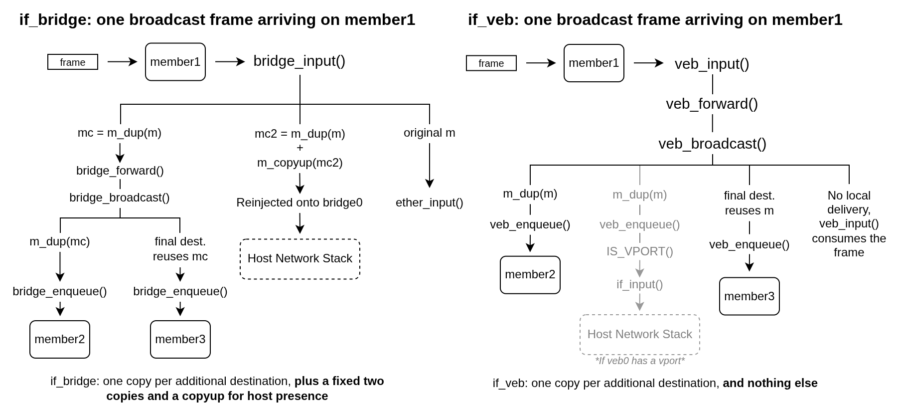

# Overview
`veb` is a virtual Ethernet bridge for FreeBSD, built for what bhyve guests and vnet jails actually produce: virtual interfaces on a single host, no physical uplink, no untrusted cabling. It is a learning L2 forwarding plane and nothing else. The host network stack is inaccessible on a veb segment unless a `vport` interface is attached.

## The "why"
This is easy to mistake for "`if_bridge` minus STP, minus pfil, minus VLAN filtering", which invites the obvious question of why this work isn't a few `if_bridge` sysctls. Those features are absent yes, but they are not the point. The structure underneath them is, and host membership is the clearest example of it.

### Implicit versus explicit host membership
`if_bridge` puts the host on every segment it bridges. For a general-purpose 802.1D bridge attached to a physical LAN that is the right default, however it comes with costs.

During broadcast and multicast, `bridge_input()` makes two deep copies of every frame. One (`mc`) goes to the forwarding path. The other (`mc2`) is reinjected onto the bridge ifnet, with an `m_copyup()` to keep the layer 3 header aligned, so the host stack gets a chance to claim multicast traffic. The original is returned for local processing on the receiving member. Both copies are made whether or not the host has any interest in the segment. This is a fixed cost per frame.

On unicast, `GRAB_OUR_PACKETS` compares every frame against the bridge's own address before forwarding, and when the `member_ifaddrs` sysctl is enabled (it is enabled by default) that comparison is repeated for every member.

`veb` changes how we go about this. A veb interface and its members are disconnected from the host network stack: `veb_transmit()` returns `ENETDOWN`, there is no reinjection, and there is no `GRAB_OUR_PACKETS` equivalent. A host that wants to be on a segment attaches a `vport`, a cloned interface that behaves roughly like one half of an `epair(4)` with a veb on the other side. It is a real interface, with its own flags, counters, MTU and addresses, and it can live in a vnet jail. Segments the host has no business on simply do not get one, and pay none of the costs above.

## Inspiration
`veb` takes its name and its basic posture from OpenBSD's `veb(4)`: explicit ports, no host presence by default. It is not a port of it. The implementation is FreeBSD-native throughout with `ifnet` and cloner KPIs and `NET_EPOCH` on the datapath. The learning table is derived from `if_bridge`, and the control ABI is its own.

## Where to next
- [design.md](design.md): the design decisions, with stable IDs for reference.
- [arch.md](arch.md): the datapath, step by step, for both veb and vport.
- [roadmap.md](roadmap.md): what is planned, and what is not.
- [contributing.md](contributing.md): how to contribute to this repo.
